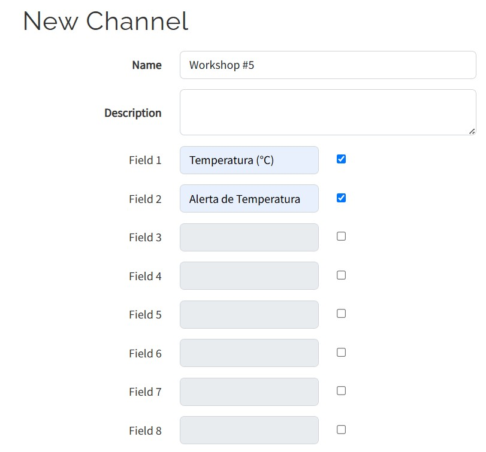
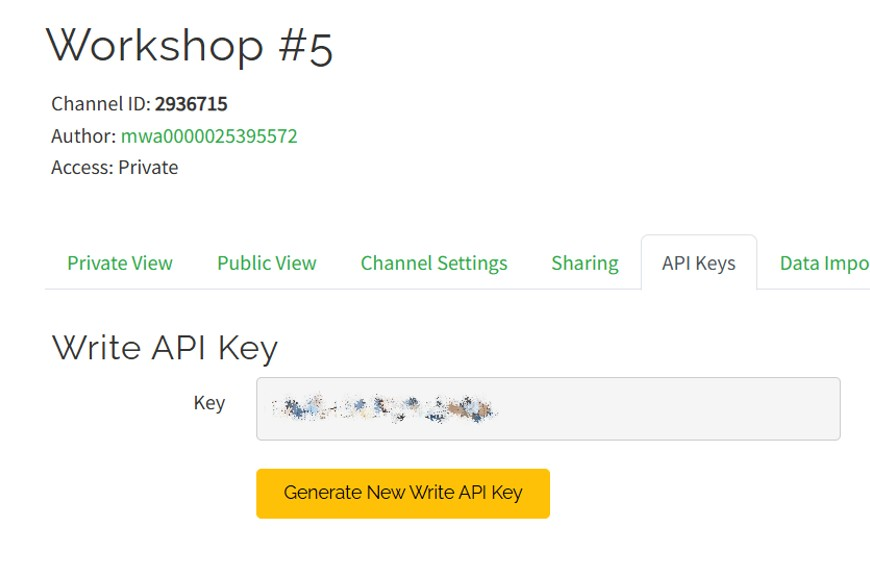
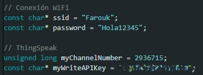
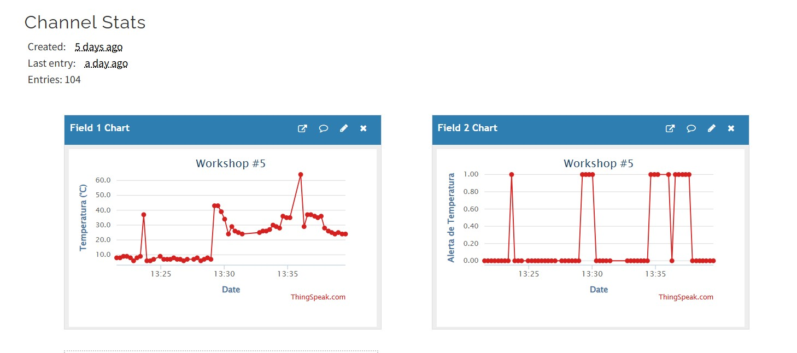
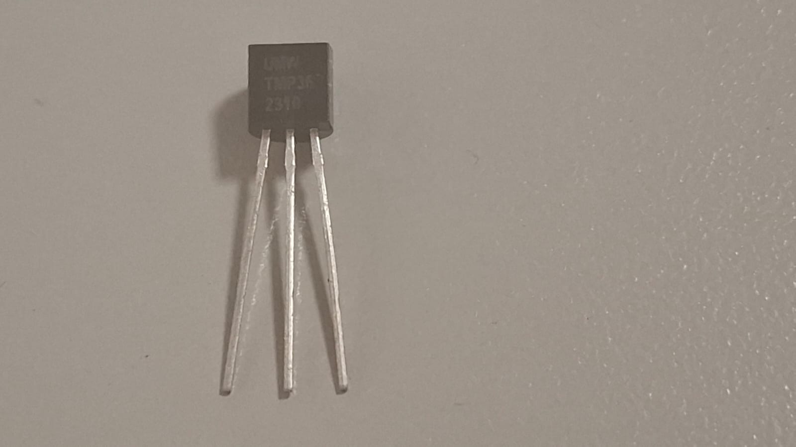
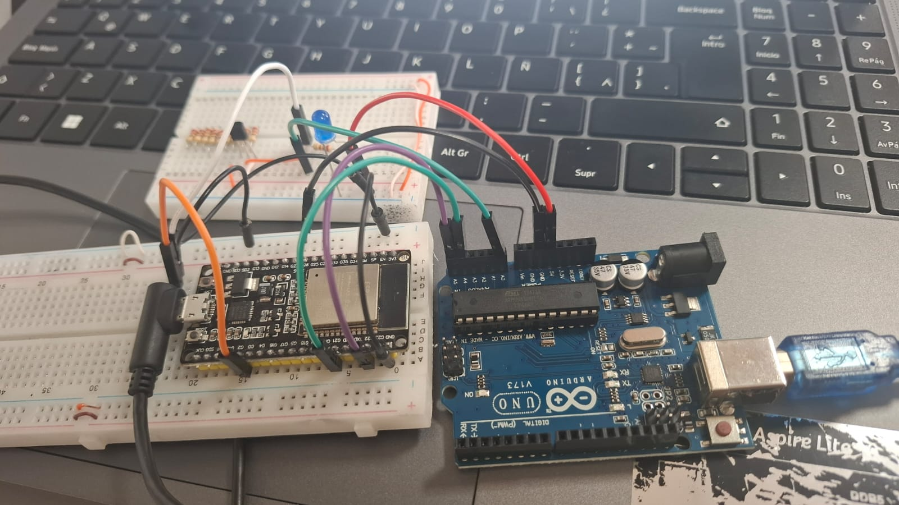

# Workshop #5 - Automatización y Control de Procesos
## Integrantes 

Tomas Candelo Montoya

Carlos Farouk Abdalá Rincón

# Dashboard de IoT usando Thing Speak
Como parte de los requerimientos solicitados, fue necesaria la creación de un Dashboard accesible desde internet que monitorizará a tiempo real el funcionamiento completo del sistema, tanto la temperatura que registrará el controlador esclavo con ayuda del sensor TMP36, como los momentos en los que se presentara alguna alerta por temperaturas altas encendiendo en el montaje físico un led.

Para cumplir dicho propósito, se hizo uso de la plataforma ThingSpeak desarrollada por MathWorks que está especialmente diseñada para recibir las señales enviadas por un controlador, en este caso el ESP32 por su módulo WiFi.

Tras iniciar sesión en la plataforma, es necesario crear un canal de comunicación. Para el desarrollo de este proyecto, la configuración dispuesta para dicho canal fue la siguiente:



De esta manera se crea un canal en el que se presentan dos gráficas para mostrar primeramente el comportamiento de la temperatura, y segundo, las alertas por temperaturas mayores a 30°C registradas por el sistema.

Tras crear el canal, es necesario extraer ciertas credenciales del mismo para permitir que nuestro controlador maestro (ESP32) envíe datos al dashboard. Estas credenciales se establecerán como variable estáticas en el código dispuesto para el manejo del controlador.

Las credenciales que necesitamos serán el Identificado del canal de comunicación (Channel ID) y la llave de escritura del canal (Write API Key).




Igualmente es necesario asignar como variables estáticas en el código el identificador y contraseña de red que va a usar el ESP32 para conectarse a internet como se ve en la imagen anterior.

Será necesario importar las librerías pertinentes, en este caso la de ThingSpeak para poder realizar la conexión, esto se hace con el comando "***#include "ThingSpeak.h"***". De esta manera las funciones para poder enviar la información ya estarán disponibles.

Finalmente, será necesario en el código del ESP32 configurar el envío de información a la plataforma de ThingSpeak, esto se hace con los siguientes comandos:
```cpp
void setup() {
  Serial.begin(115200);
  Wire.begin(); // ESP32 como maestro
  pinMode(ledPin, OUTPUT);

  WiFi.begin(ssid, password);
  while (WiFi.status() != WL_CONNECTED) {
    delay(500);
    Serial.print(".");
  }
  Serial.println("\nWiFi connected");

  ThingSpeak.begin(client); // Iniciar ThingSpeak
} 
```


Para inicializar la comunicación como cliente a la plataforma, y:

```cpp
ThingSpeak.setField(1, tempReceived); // Campo 1 para temperatura
ThingSpeak.setField(2, tempReceived > 30 ? 1 : 0); // Campo 2 para alerta (1 o 0)

int x = ThingSpeak.writeFields(myChannelNumber, myWriteAPIKey);
```
Para escribir la información recibida en los dashboard, en este caso, el campo o gráfica 1, que es la de temperatura, recibirá y mostrará gráficamente el comportamiento de dicha variable cada 15 segundos debido a la configuración de ThingSpeak, y el campo dos mostrará una gráfica en la que se mostrará con el mismo tiempo de actualización si la variable está o no superando el límite de los 30°C establecidos, siendo el valor de 1 la señal de que se ha superado el límite, y de 0 la señal de que la temperatura esta debajo del límite.
A continuación una muestra del resultado en ThingSpeak:



# Implementación Física

Para el desarrollo físico del proyecto, fue necesario adquirir un controlador diferente al de la simulación en TinkerCad, esto debido a que los Arduino UNO que son los controladores manejados por el software de simulación no contienen módulos WiFi que permitan desarrollar la implementación de IoT en el proyecto. Por ello, se reemplazo el controlador maestro por un ESP32 que cumpliera dicha característica. La comunicación se manejó de la misma manera cambiando los pines enfocados para la transmisión de y recibimiento de señal de reloj y de datos. 

La comunicación se hizo teniendo en cuenta los pines de transferencia de Datos (SDA) y de señal de reloj para la comunicación I2C (SCL). Las conexiones fueron las siguientes:

## Conexiones Arduino y ESP32

| PIN (Arduino) [1] | Conexión                                  | PIN (ESP32) [2]   | Conexión                                      |
|---------------|-------------------------------------------|---------------|-----------------------------------------------|
| A0            | Señal de Sensor de Temperatura            | G2            | Señal de Advertencia de Temperatura (LED)     |
| A4 (SDA)      | PIN G21 (SDA) del ESP32                   | G21 (SDA)     | PIN A4 (SDA) del Arduino Uno                  |
| A5 (SCL)      | PIN G22 (SCL) del ESP32                   | G22 (SCL)     | PIN A5 (SCL) del Arduino Uno                  |
| 5V            | Línea de Alimentación para el Sensor      | 5V            | No Aplica       |
| GND           | GND común del proyecto                    | GND           | GND común del proyecto                        |

Ambos controladores se alimentaron desde su conexión a la computadora por medio de cables USB. El **ESP32** se alimentó a través de un cable **USB a microUSB**, mientras que el **Arduino Uno** se alimentó mediante un cable **USB a Jack de Alimentación**.

La alimentación de el esto del proyecto se desarrollo dando los 5V que ofrece el Arduino para alimentar el sensor de temperatura.

Las tierras se unificaron para asegurarse de que haya una referencia común de voltaje asegurando el buen funcionamiento de la conexión I2C y evitar señales erróneas [3].

Para la medición de temperatura, se utilizó inicialmente un sensor **LM35**. Sin embargo, debido a los errores frecuentes en la lectura y las reseñas negativas que presenta esta referencia dentro de la comunidad, se optó por reemplazarlo por un sensor **TMP36**, el cual ofrece mayor precisión y estabilidad en las mediciones. Se conecto de acuerdo a [4].



Se hizo uso de cables UTP y de Jumpers para la conexión física además de una Protoboard para conectar el led (y una resistencia de 220 Ohms) que indicará de manera real cuando la temperatura supere los 30°C y para el sensor TMP36, y otra para colocar el ESP32 y sus respectivas conexiones.

El montaje final resultó de la siguiente manera.


## Referencias  

[1] Arduino, "Arduino Uno Rev3 Datasheet," 2016. [Online]. Available: [https://docs.arduino.cc/resources/datasheets/A000066-datasheet.pdf](https://docs.arduino.cc/resources/datasheets/A000066-datasheet.pdf). [Accessed: 27-Abr-2025].  

[2] Last Minute Engineers, "ESP32 Pinout Reference: Which GPIO pins should you use?," [Online]. Available: https://lastminuteengineers.com/esp32-pinout-reference/. [Accessed: 27-Abr-2025].

[3] Arduino Forum, "I2C common ground," [Online]. Available: https://forum.arduino.cc/t/i2c-common-ground/618661. [Accessed: 27-Abr-2025].

[4] Para Arduino, "Sensor de temperatura TMP36," [Online]. Available: https://paraarduino.com/sensores/sensor-de-temperatura-tmp36/. [Accessed: 27-Abr-2025].